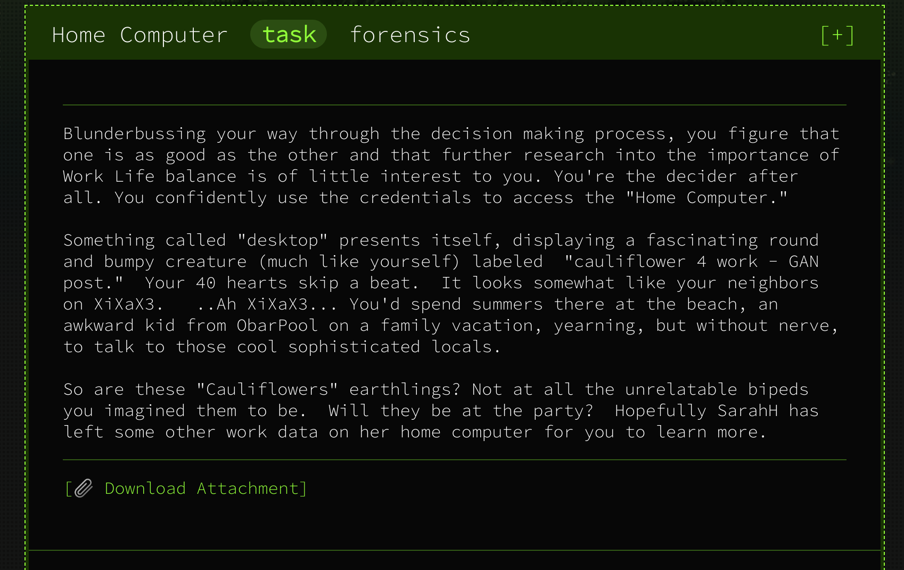

# Home Computer



#### **Given:** archive with two files - `family.ntfs` and `note.txt`

`note.txt` contains a tip for Mac users. I'm on Linux, so moving on.

Let's check if `family.ntfs` is really what we think it is:
```
> file family.ntfs 
family.ntfs: DOS/MBR boot sector, code offset 0x52+2, OEM-ID "NTFS    ", sectors/cluster 8, 
Media descriptor 0xf8, sectors/track 0, dos < 4.0 BootSector (0x80), FAT (1Y bit by descriptor); 
NTFS, sectors 51199, $MFT start cluster 4, $MFTMirror start cluster 3199, bytes/RecordSegment 2^(-1*246), 
clusters/index block 1, serial number 072643f694104cb6f
```
It is NTFS file system, indeed. Now it's time to mount it!
```
> mkdir mnt
> mount family.ntfs mnt
> ls -hl mnt
total 24K
-rwxrwxrwx 1 root root    0 Jun 13  2019  bootmgr
-rwxrwxrwx 1 root root    0 Jun 13  2019  BOOTNXT
-rwxrwxrwx 1 root root    0 Jun 13  2019  pagefile.sys
drwxrwxrwx 1 root root 4.0K Jun 13  2019 'Program Files'
drwxrwxrwx 1 root root 4.0K Jun 13  2019 'Program Files (x86)'
-rwxrwxrwx 1 root root    0 Jun 13  2019  Setup.log
-rwxrwxrwx 1 root root    0 Jun 13  2019  SSUUpdater.log
-rwxrwxrwx 1 root root    0 Jun 13  2019  swapfile.sys
drwxrwxrwx 1 root root    0 Jun 13  2019  Users
drwxrwxrwx 1 root root  16K Jun 13  2019  Windows
```
`Users` directory looks interesting. Checking disk usage:
```
> du -sh Users/*
0	Users/desktop.ini
13K	Users/Family

> du -sh Users/Family/*
0	Users/Family/Desktop
512	Users/Family/Documents
0	Users/Family/Downloads
8.0K	Users/Family/Pictures
```

Let's take a look at `Documents`:
```
 
> ls -hl Users/Family/Documents/
total 512
-rwxrwxrwx 1 root root 58 Jun 13  2019 credentials.txt
-rwxrwxrwx 1 root root  0 Jun 13  2019 document.pdf
-rwxrwxrwx 1 root root  0 Jun 13  2019 preview.pdf

> cat Users/Family/Documents/credentials.txt
I keep pictures of my credentials in extended attributes.
```
Beautiful. We'll use `getfattr` command to get list of extended attributes of all files in the parent directory, recursively
```
> getfattr -R .
# file: mnt/Users/Family/Documents/credentials.txt
user.FILE0
```
Let's get the value of this attribute, keeping in mind that it's an image:
```
> getfattr -n user.FILE0 --only-values mnt/Users/Family/Documents/credentials.txt > result
```
Checking the result file with `file` command:
```
> file result
result: PNG image data, 1234 x 339, 8-bit/color RGB, non-interlaced
```


**Flag:CTF{congratsyoufoundmycreds}** 

