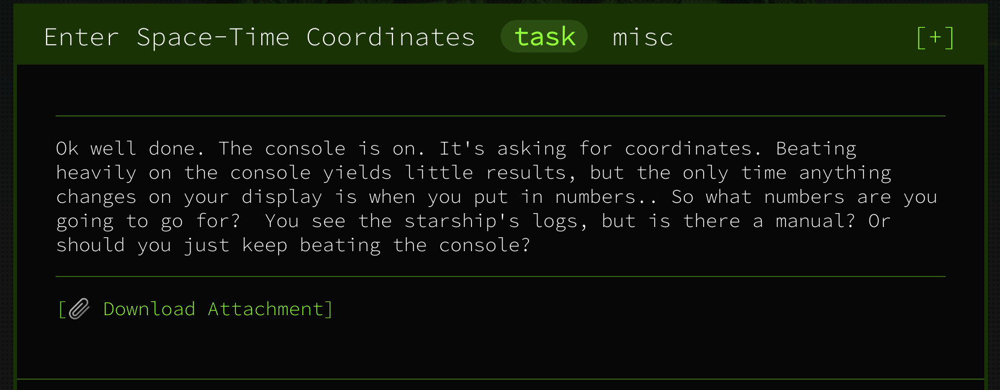

# Space-Time Coordinates



##### **Given:** archive with two files - `log.txt` and `rand2`.

`log.txt` contains a set of coordinates:

```
0: AC+79 3888{6652492084280_198129318435598}
1: Pliamas Sos{276116074108949_243544040631356}
2: Ophiuchus{11230026071572_273089684340955}
3: Pax Memor -ne4456 Hi Pro{21455190336714_219250247519817}
4: Camion Gyrin{235962764372832_269519420054142}
```
Let's try to execute `rand2`:

```
> ./rand2
0: AC+79 3888 - 184213774666663, 226721662506794
1: Pliamas Sos - 110443777793670, 14395187088780
2: Ophiuchus - 53469275962543, 251492205119601
3: Pax Memor -ne4456 Hi Pro - 248283182003403, 199797158599805
4: Camion Gyrin - 231760189148621, 119850317156069
5: CTF - <REDACTED>

Enter your destination's x coordinate:
>>> 184213774666663
Enter your destination's y coordinate:
>>> 226721662506794
Arrived somewhere, but not where the flag is. Sorry, try again.
```
Now let's check what rand2 actually is:
```
> file rand2
rand2: ELF 64-bit LSB pie executable, x86-64, version 1 (SYSV), dynamically linked, interpreter /lib64/ld-linux-x86-64.so.2, for GNU/Linux 3.2.0, BuildID[sha1]=0208fc60863053462fb733436cef1ed23cb6c78f, not stripped
```
It's non-stripped ELF, let's try to get strings:
```
> strings rand2
[...]
Arrived at the flag. Congrats, your flag is: CTF{welcome_to_googlectf}
[...]
```
Here's the first flag!

**Flag: CTF{welcome_to_googlectf}**
