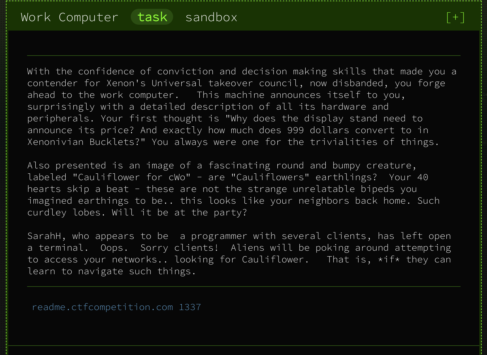

# Work Computer



#### **Given:** remote address readme.ctfcompetition.com 1337

Connecting to the remote. According to the problem description we should see a shell.
```
netcat readme.ctfcompetition.com 1337
> 
```
Okay, let's try to play a bit with this shell:
```
> ls
ORME.flag
README.flag
> cat README.flag
error: No such file or directory
> cat    
error: No such file or directory
> less
error: No such file or directory
> head
error: No such file or directory
```
We can see two `.flag`-files, but it seems that standard file-reading tools are not available.

Let's see what's available:
```
> pwd
/challenge
> cd ..
> pwd
/
> ls /bin /usr/bin /sbin /usr/sbin
```
There's a bunch of commands available on this system, but I cannot recognize any of them as file-reading.

What's interesting though, there's a busybox present! Let's try to run it:
```
> busybox
busybox can not be called for alien reasons.
```


Trying out some privileges-related utils:
```
> su
error: No such file or directory
> sudo
error: No such file or directory
> setpriv
BusyBox v1.29.3 (2019-01-24 07:45:07 UTC) multi-call binary.
[...]
```
`setpriv` is available! (And also linked to busybox).
```
> setpriv busybox cat README.flag
CTF{4ll_D474_5h4ll_B3_Fr33}
> setpriv busybox cat ORME.flag
cat: can't open 'ORME.flag': Permission denied
> ls -l
total 8
----------    1 1338     1338            33 Apr 11 19:12 ORME.flag
-r--------    1 1338     1338            28 Apr 11 19:12 README.flag
> setpriv busybox chmod +r ORME.flag
> setpriv busybox cat ORME.flag
CTF{Th3r3_1s_4lw4y5_4N07h3r_W4y}
```

**Flag1: CTF{4ll_D474_5h4ll_B3_Fr33}**

**Flag2: CTF{Th3r3_1s_4lw4y5_4N07h3r_W4y}**

Resources used:
[List of BusyBox commands](https://boxmatrix.info/wiki/BusyBox-Commands)
